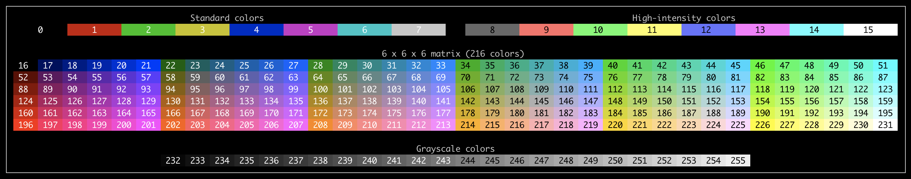
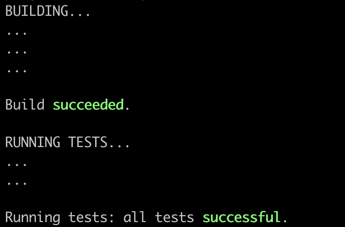
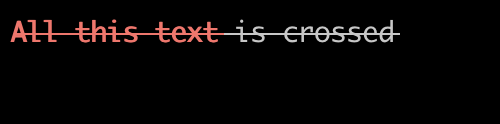

# Go Color Term [](https://github.com/go-color-term/go-color-term/actions/workflows/go.yml) [](https://github.com/nelsonghezzi/go-color-term/blob/main/LICENSE)

Welcome to Go Color Term! the place where your monochromatic terminal meets a colorful world!

This library allows to apply [_ANSI Escape Sequences_](https://en.wikipedia.org/wiki/ANSI_escape_code#SGR_(Select_Graphic_Rendition)_parameters) to alter the style of the rendered text on a Terminal.



## Supported Operating Systems and Terminals

Linux, macOS and Windows are supported. See the sections belows for specific details of each platform.

### Linux

It should work out of the box with most terminal/shell combinations.

### macOS

Support in macOS should be pretty decent, but perhaps some settings must be manually enabled in the terminal for some features.

<table>
  <thead>
    <tr>
      <td>Terminal</td>
      <td>Shell</td>
      <td>Notes</td>
    </tr>
  </thead>
  <tbody>
    <tr>
      <td rowspan="2">Terminal<p><small>2.11 (440)</small></p></td>
      <td>Zsh<p><small>5.8</small></p></td>
      <td>✅ Working</td>
    </tr>
    <tr>
      <td>Bash<p><small>3.2.57</small></p></td>
      <td>✅ Working</td>
    </tr>
    <tr>
      <td rowspan="2">iTerm2<sup><a href="#macos-ref-1">[1]</a></sup><sup><a href="#macos-ref-2">[2]</a></sup><sup><a href="#macos-ref-3">[3]</a></sup><p><small>3.4.4</small></p></td>
      <td>Zsh<p><small>5.8</small></p></td>
      <td>✅ Working<sup><a href="#macos-ref-4">[4]</a></sup></td>
    </tr>
    <tr>
      <td>Bash<p><small>3.2.57</small></p></td>
      <td>✅ Working<sup><a href="#macos-ref-4">[4]</a></sup></td>
    </tr>
  </tbody>
</table>

<sup id="macos-ref-1">[1]</sup> Bold support requires "Draw bold text in bold font" to be enabled in terminal profile.
<br>
<sup id="macos-ref-2">[2]</sup> Italics support requires "Italic text" to be enabled in terminal profile.
<br>
<sup id="macos-ref-3">[3]</sup> Blink support requires "Blinking text" to be enabled in terminal profile.
<br>
<sup id="macos-ref-4">[4]</sup> Conceal not supported.

### Windows

Support in Windows is pretty decent too, but limitations are present in some terminals or with some terminal/shell combinations.

<table>
  <thead>
    <tr>
      <td>Terminal</td>
      <td>Shell</td>
      <td>Notes</td>
    </tr>
  </thead>
  <tbody>
    <tr>
      <td rowspan="3">conhost.exe<sup><a href="#windows-ref-1">[1]</a></sup><sup><a href="#windows-ref-6">[6]</a></sup><p><small>10.0.19041.746</small></p></td>
      <td>CMD<p><small>10.0.19041.746</small></p></td>
      <td>✅ Working<sup><a href="#windows-ref-2">[2]</a></sup><sup><a href="#windows-ref-3">[3]</a></sup><sup><a href="#windows-ref-4">[4]</a></sup><sup><a href="#windows-ref-5">[5]</a></sup></td>
    </tr>
    <tr>
      <td>Windows PowerShell<p><small>5.1 (19041.868)</small></p></td>
      <td>✅ Working<sup><a href="#windows-ref-2">[2]</a></sup><sup><a href="#windows-ref-3">[3]</a></sup><sup><a href="#windows-ref-4">[4]</a></sup><sup><a href="#windows-ref-5">[5]</a></sup></td>
    </tr>
    <tr>
      <td>PowerShell Core<p><small>7.1.3</small></p></td>
      <td>✅ Working<sup><a href="#windows-ref-2">[2]</a></sup><sup><a href="#windows-ref-3">[3]</a></sup><sup><a href="#windows-ref-4">[4]</a></sup><sup><a href="#windows-ref-5">[5]</a></sup></td>
    </tr>
    <tr>
      <td rowspan="4">Windows Terminal<p><small>1.6.10571.0</small></p></td>
      <td>CMD<p><small>10.0.19041.746</small></p></td>
      <td>✅ Working</td>
    </tr>
    <tr>
      <td>Windows PowerShell<p><small>5.1 (19041.868)</small></p></td>
      <td>✅ Working</td>
    </tr>
    <tr>
      <td>PowerShell Core<p><small>7.1.3</small></p></td>
      <td>✅ Working</td>
    </tr>
    <tr>
      <td>Bash<p><small>4.4.23</small></p></td>
      <td>❌ Not working</td>
    </tr>
    <tr>
      <td>mintty<p><small>3.4.6</small></p></td>
      <td>Bash<p><small>4.4.23</small></p></td>
      <td>✅ Working<sup><a href="#windows-ref-3">[3]</a></td>
    </tr>
    <tr>
      <td>VS Code integrated terminal<p><small>1.54.3</small></p></td>
      <td>CMD<p><small>10.0.19041.746</small></p></td>
      <td>✅ Working<sup><a href="#windows-ref-2">[2]</a></sup><sup><a href="#windows-ref-3">[3]</a></sup><sup><a href="#windows-ref-5">[5]</a></sup></td>
    </tr>
  </tbody>
</table>

<sup id="windows-ref-1">[1]</sup> You might need to <a href="https://superuser.com/a/1300251">enable support</a> for it.
<br>
<sup id="windows-ref-2">[2]</sup> Faint not supported.
<br>
<sup id="windows-ref-3">[3]</sup> Blink not supported.
<br>
<sup id="windows-ref-4">[4]</sup> Conceal not supported.
<br>
<sup id="windows-ref-5">[5]</sup> Strikethrough not supported.
<br>
<sup id="windows-ref-6">[6]</sup> Bold seems to increase font brightness not font weight.

## Examples

Check the [accompanying repository](https://github.com/go-color-term/go-color-term-examples) with a ready-to-run app which recopiles various examples to showcase the library API.

## How to use

This library provides several ways to add color to your output, tailored for different use cases.

The idea is to provide with the simplest way to render styled text for each situation.

| Method                         | Use Case                                                                      |
|--------------------------------|-------------------------------------------------------------------------------|
| `coloring.*` utility functions | Simple, ad-hoc styling                                                        |
| `StyleBuilder`                 | Combining multiple styles; reusing the same style for various strings         |
| `StyledText`                   | Sealed, self-contained styled string useful for passing around                |
| `SentenceBuilder`              | Complex styling; full control of placing (start and end) of style attributes  |

The next sections describes each of these approaches in more detail.

In the examples below, whenever you encounter the string sequence `ESC`, it symbolically refers the the byte `0x1B` (`27` in decimal or `33` in octal) which is the control character used to start the ANSI escape sequences.

### `coloring.*` utility functions

This are utility functions that lets you apply simple style attributes to a provided string, like:

```go
coloring.Red("Fire truck")
```

This will produce the following escaped string:

```
ESC[31mFire truckESC[39m
```

Which be can decompose for analysis into:

```
 Sets red     Resets text color
text color       to default
    |                |
    v                v
 -------          -------
 ESC[31mFire truckESC[39m
        ----------
            ^
            |
     Provided string
```

Of course you can combine multiple styles by passing the output of one function to another:

```go
coloring.Bold(coloring.Red("Wolf"))
```

This is probably fine for a few function calls, but can become difficult to read if the combination grows larger.

Also, this approach, while it works, doesn't generate the most efficient escape sequences:

```
ESC[1mESC[31mWolfESC[39mESC[22m
```

A more compact sequence for the same style would be `ESC[1;31mWolfESC[0m`, which is the topic of the next section.

The full list of utility functions is:
* `Black(s string)`
* `Red(s string)`
* `Green(s string)`
* `Yellow(s string)`
* `Blue(s string)`
* `Magenta(s string)`
* `Cyan(s string)`
* `White(s string)`
* `BgBlack(s string)`
* `BgRed(s string)`
* `BgGreen(s string)`
* `BgYellow(s string)`
* `BgBlue(s string)`
* `BgMagenta(s string)`
* `BgCyan(s string)`
* `BgWhite(s string)`
* `Bold(s string)`
* `Faint(s string)`
* `Italic(s string)`
* `Underline(s string)`
* `Blink(s string)`
* `Invert(s string)`
* `Conceal(s string)`
* `Strikethrough(s string)`

Also, and to not pollute the `coloring` package API surface with too many functions, and `Extras` field exposes additional non-standard or not widely supported features.

Most notably, this includes bright versions for text and backgroud colors, like `coloring.Extras.BrightRed`.

The full list of extra functions is:
* `BrightBlack(s string)`
* `BrightRed(s string)`
* `BrightGreen(s string)`
* `BrightYellow(s string)`
* `BrightBlue(s string)`
* `BrightMagenta(s string)`
* `BrightCyan(s string)`
* `BrightWhite(s string)`
* `BgBrightBlack(s string)`
* `BgBrightRed(s string)`
* `BgBrightGreen(s string)`
* `BgBrightYellow(s string)`
* `BgBrightBlue(s string)`
* `BgBrightMagenta(s string)`
* `BgBrightCyan(s string)`
* `BgBrightWhite(s string)`

See [coloring/utility.go](https://github.com/nelsonghezzi/go-color-term/blob/main/coloring/utility.go) for implementation details.

### `StyleBuilder`

When you need to apply multiple styles to the same word/phrase you can use a `StyleBuilder`:

```go
boldRedFiretruck := coloring.For("fire truck").Bold().Red()
```

Then you can use it as a `string` argument for formatting functions:

```go
fmt.Printf("Here comes the %s\n", boldRedFiretruck)
```

That's because `StyleBuilder` implements the [`Stringer`](https://golang.org/pkg/fmt/#Stringer) interface.

If you need the styled `string` for use in other contexts not expecting a `Stringer`, just call the `String()` func on the `StyleBuilder`:

```go
styledFiretruck := boldRedFiretruck.String()

// pass or use the styledFiretruck string as needed
```

Styles generated by `StyleBuilder` combine multiple attributes in a single escape sequence and **resets all the styles** at the end. For example, the following code:

```go
styledWolf := coloring.For("Wolf").Red().Bold().Underline().Blink().String()
````

creates the escaped string:

```
ESC[31;1;4;5mWolfESC[0m
```

If you pretend to reuse the same style for different `string`s, you can do so by using the `New()` shorthand, and then calling `Func()` at the end, which will give you a `ColorizerFunc` that can be invoked with different `string`s:

```go
boldRed := coloring.New().Bold().Red().Func()

fmt.Printf("Here comes the %s to extinguish the %s\n", boldRed("fire truck"), boldRed("fire"))
```

Whether to use `For(string)` or `New()` + `Func()` will be a matter of reusability needs.

Finally, if you only need to print the styled text and nothing else, `StyleBuilder` offers a convenience function: `Print()`.

It returns a `ColorizerPrint` which can be invoked with the text to print, much like the `ColorizerFunc`, but instead of returning the styled `string`, it only outputs on the terminal:

```go
printAlert := coloring.New().White().Bold().Background().Red().Print()

printAlert("ALERT: The house is on fire!!!\n")
```


And now you also know why the firemen were coming in the first place!

`StyleBuilder` provides functions for the following:
* Set basic colors: `Black()`, `Red()`, `Green()`, `Yellow()`, `Blue()`, `Magenta()`, `Cyan()`, `White()`.
* Set custom colors:
  * 8-bit colors: `Color(int)` passing a number in the range 0-255 (use constants on `coloring` package for the first 0-15 values).
  * 24-bit colors: `ColorRgb(int, int, int)` passing numbers in the 0-255 range for each RGB component.
* Set background color: `Background()` + equivalent methods.
* Set other style attributes: `Bold()`, `Faint()`, `Italic()`, `Underline()`, `Blink()`, `InvertColors()`, `Strikethrough()`.

### `StyledText`

This can be considered a spin-off from `ColorBuilder` that lets you get a "sealed" styled string which can't be further modified.

The `StyledText` struct also implements `Stringer` so it can be used as a parameter for any function expecting one.

The motivation behind this type is to allow for the separation between styled text _definition_ and _usage_. You can create a `ColorBuilder` at program start, and then get multiple `StyledText`s that you can pass around to the rest of the program handling console output.

The main (and only) difference to a plain `string` is that `StyledText` also contains an `Unformatted()` function which returns the original, unstyled `string`. This could come in handy if for some reason you need to alternate the display of the styled text and the plain text (i.e.: the one without styles).

The following example tries to illustrate the idea.

```go
func main() {
	boldGreenTextBuilder := coloring.New().Bold().Green()

	successfulTitle := boldGreenTextBuilder.StyleText("successful")
	successTitle := boldGreenTextBuilder.StyleText("succeeded")

	pipeline(successfulTitle, successTitle)
}

func pipeline(successTitle, successfulTitle *coloring.StyledText) {
	fmt.Println("BUILDING...")

	// "building"
	fmt.Println("...")
	fmt.Println("...")
	fmt.Println("...")
	fmt.Println()
	fmt.Printf("Build %s.\n", successfulTitle)
	fmt.Println()

	fmt.Println("RUNNING TESTS...")

	// "testing"
	fmt.Println("...")
	fmt.Println("...")
	fmt.Println()
	fmt.Printf("Running tests: all tests %s.", successTitle)
	fmt.Println()
}
```



### `SentenceBuilder`

This is perhaps the most cumbersome way to add style attributes, but in return it provides more granular control to mark the start and end of each style attribute.

The biggest advantage is that you can apply styles that spans different sections of the text in a non-uniform way, like crossed text covering bold red text and regular text.

Of course this is also doable with the other APIs, but it will be more repetitive to accomplish.

```go
coloring.Sentence().
  StrikethroughStart().
  ColorSet(coloring.RED).
  Bold("All this text").
  ColorReset().
  Text(" is crossed").
  Println()
```



Multiple things are going on there:
* `StrikethroughStart()` marks the start of crossed text.
* `ColorSet(coloring.RED)` marks the start of red text.
* `Bold("All this text")` outputs the given text with bold style.
* `ColorReset()` sets text color back to the default one.
* `Text(" is crossed")` adds normal (non-styled) text.
* `Println()` resets all styles and then prints the whole sentence to `stdout`.

All the functions of the `SentenceBuilder` API comes in two flavours:
* One that outputs a single chunk of text with a single stlye (like `Bold("All this text")` in the example above).
* A pair of functions in the form `XXXStart`/`XXXEnd` that lets you start some style and leave it "open" until you call the corresponding "end" function, much like closing an HTML tag. `ColorSet`/`ColorReset` are the exception to this naming convention, but serves the same purpose.

You might notice that we didn't call `StrikethroughEnd` on the previous example. But that's fine, since we are ending the sentence with `Println()`, which adds the attribute to reset al styles before writing the output. The rationale behind this is to not "leak" any styles in subsequent output.

Dissecting the generated string will complete the picture:

```
Strikethrough starts  Bold starts         Bold ends         All attributes cleared
          |                |                  |                        |
          v                v                  v                        v
       ------           ------             -------                  ------
       ESC[9mESC[38;5;1mESC[1mAll this textESC[22mESC[39m is crossedESC[0m
             -----------                          -------
                  ^                                  ^
                  |                                  |
            Red color set                       Color reset
```

Given that the `SentenceBuilder` API is quite large, there are no color-named functions for setting colored text/background, as it will expand the API surface further. There's only one method to write colored text/background which expects to receive the color number as a parameter (and equivalent ones for RGB colors).

As with `ColorBuilder`, `SentenceBuilder` also lets you grab a `StyledText` containing the buffered styled text so far, as well the unformatted text.

The full list of `SentenceBuilder` functions is:
* `Text`
* `Color`, `ColorSet`, `ColorRgb`, `ColorRgbSet`, `ColorReset`
* `Background`, `BackgroundSet`, `BackgroundRgb`, `BackgroundRgbSet`, `BackgroundReset`
* `Bold`, `BoldStart`, `BoldEnd`
* `Faint`, `FaintStart`, `FaintEnd`
* `Italic`, `ItalicStart`, `ItalicEnd`
* `Underline`, `UnderlineStart`, `UnderlineEnd`
* `Blink`, `BlinkStart`, `BlinkEnd`
* `Invert`, `InvertStart`, `InvertEnd`
* `Conceal`, `ConcealStart`, `ConcealEnd`
* `Strikethrough`, `StrikethroughStart`, `StrikethroughEnd`
* `Reset`
* `String`, `Print`, `PrintAndClear`, `Println`, `PrintlnAndClear`, `StyledText`

See [coloring/sentence_builder.go](https://github.com/nelsonghezzi/go-color-term/blob/main/coloring/sentence_builder.go) for full documentation on each function.

## Licence

This project is licensed under the terms of the [MIT License](https://github.com/nelsonghezzi/go-color-term/blob/main/LICENSE).

## Contributing

Feel free to add contributions in the form of [issues](https://github.com/nelsonghezzi/go-color-term/issues), [pull requests](https://github.com/nelsonghezzi/go-color-term/pulls) or [discussions](https://github.com/nelsonghezzi/go-color-term/discussions).
